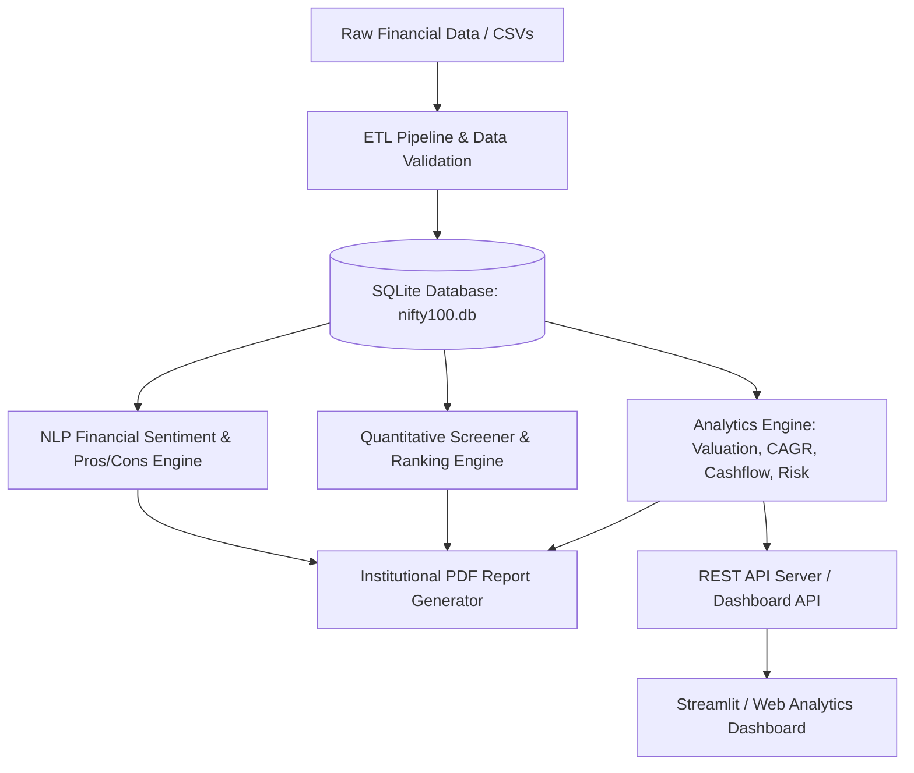

# BlueStocks Financial Intelligence Platform - System Architecture

## 1. System Overview

BlueStocks is an institutional-grade financial data foundation and equity research analytics platform designed to ingest, validate, standardize, analyze, screen, and generate multi-page institutional research reports for Indian equities (NIFTY 100 universe).

---

## 2. Core Subsystems

### 2.1 ETL & Validation Pipeline (`src/etl/`)
- **`loader.py`**: Ingests raw balance sheets, profit & loss statements, cash flow statements, and company metadata into normalized SQLite tables.
- **`validator.py`**: Executes 35+ automated data quality checks including:
  - Balance Sheet Equality (`Total Assets == Total Liabilities + Equity`).
  - Cash Flow Reconciliation (`Net Cash Flow == Operating + Investing + Financing`).
  - Logical Bounds (Margins, Growth Rates, Non-negative shares).
- **`normaliser.py`**: Standardizes accounting line items across divergent reporting formats (Ind AS, IFRS, Indian GAAP).

### 2.2 Financial Analytics Engine (`src/analytics/`)
- **`valuation.py`**: Computes relative valuation metrics (P/E, P/B, EV/EBITDA, Dividend Yield) and historical decile distributions.
- **`dupont.py`**: Decomposes Return on Equity (ROE) via 3-step (Operating Margin × Asset Turnover × Financial Leverage) and 5-step (Tax Burden × Interest Burden × Operating Margin × Asset Turnover × Financial Leverage) models.
- **`cagr.py`**: Calculates multi-period compound annual growth rates (1Y, 3Y, 5Y, 10Y) for Revenue, EBITDA, Net Profit, and Operating Cash Flow.
- **`cashflow_kpis.py`**: Evaluates Free Cash Flow (FCF), FCF Conversion Rates, Cash Flow to Debt, and Cash Reinvestment Ratios.
- **`peer.py`**: Constructs peer groups by industry sector and market capitalization bucket, normalizing metrics for cross-sectional ranking.
- **`risk.py`**: Computes Value at Risk (VaR), Conditional VaR (CVaR), Sharpe/Sortino ratios, and Monte Carlo multi-period forecast simulations.

### 2.3 Quantitative Screener Engine (`src/screener/`)
- **`engine.py`**: Rule-based filtering and composite multi-factor scoring (Quality, Value, Growth, Financial Health).
- **`multi_factor.py`**: Customizable multi-factor percentile ranking model weighting Growth, Value, Profitability/Quality, and Solvency metrics into a composite score (0-100).
- Supports dynamic filter predicates (e.g., `ROE > 15%`, `Debt/Equity < 0.5`, `P/E < Sector Median`).

### 2.4 NLP & Financial Sentiment Parser (`src/nlp/`)
- **`parser.py`**: Tokenizes and analyzes management commentary, annual report MD&A sections, and earnings call transcripts.
- **`pros_cons_generator.py`**: Generates investment thesis bullet points with quantitative backing and confidence scores.

### 2.5 Institutional PDF Report Generation (`src/reports/`)
- **`tearsheet.py`**: Produces 2-page institutional company tearsheets with radar charts, DuPont analysis, and 5-year financial tables.
- **`sector_report.py`**: Compiles sector-wide thematic reports with industry medians and leaderboards.
- **`portfolio_report.py`**: Assembles comprehensive 92-company portfolio master books with table of contents and executive summaries.
- **`url_explainable_ai_report.py`**: Generates Explainable AI (XAI) auditing reports explaining model signals and factor attribution.

### 2.6 Dashboard & API Services (`src/dashboard/`, `src/api_server.py`)
- **`src/api_server.py`**: Lightweight embedded REST API with endpoints for database health, company screening, risk analytics, and metadata.
- **`src/dashboard/app.py`**: Interactive analytical dashboard built with Streamlit providing visualization for KPIs, DQ errors, and peer heatmaps.

---

## 3. Database Schema

The core SQLite database schema maintains foreign key integrity across:
- `companies`: Master metadata (Ticker, Name, Sector, Industry, Market Cap, ISIN).
- `income_statements`: Multi-year P&L items (Revenue, EBITDA, EBIT, EBT, PAT, EPS).
- `balance_sheets`: Asset, Liability, and Equity breakdowns across financial years.
- `cash_flows`: Operating, Investing, and Financing cash flows.
- `financial_ratios`: Precomputed valuation, leverage, liquidity, and profitability metrics.
- `validation_failures`: Log of all data quality rule violations, categorised by severity (`CRITICAL`, `WARNING`, `INFO`).

---

## 4. Quality Assurance & Testing Suite

Testing is structured into modular suites executed via `pytest`:
- Unit tests: Financial formulas, ETL transformations, NLP parsers, report renderers.
- Integration tests: End-to-end data pipeline from raw ingestion to database tables and PDF output verification.
- Continuous Integration: GitHub Actions workflow (`.github/workflows/ci.yml`) ensuring clean linting, high test coverage, and artifact reproducibility.
